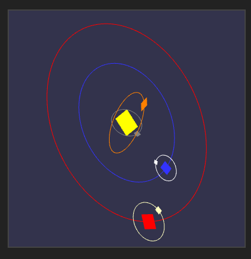
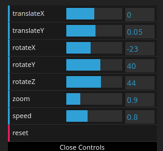

# Sistema Solar en WebGL



En este proyecto se renderiza, utilizando ```WebGL```, un sistema solar en el que los planetas se representan como cuadrados. En el centro se encuentra un cuadrado amarillo representando al sol y a su alrededor orbitan cuadrados que representan planetas del sistema solar y algunos de sus satélites. También se representa en la simulación las órbitas que recorren los planetas y satélites.

Es posible mover y rotar la cámara, hacer zoom y cambiar la velocidad de la simulación.

El objetivo del proyecto es hacer uso de transformaciones, tanto para escalar y situar los objetos, como para rotar y mover la cámara.

## Acceso a la versión web

La versión web de este proyecto se encuentra en [este sandbox de codesandbox](https://gsrpxw.csb.app/).

El código se puede acceder desde [este enlace](https://codesandbox.io/p/sandbox/webgl-practica-3-gsrpxw).

## Ejecución del proyecto en local

A continuación, se detallan las instrucciones de ejecución del proyecto de forma local en caso de que la version web fallara.

1. Descargar o clonar el repositorio

2. Descargar e instalar la version mas reciente de ``Node.js`` desde [este enlace](https://nodejs.org/en)

3. Para asegurar que la instalación se realizó correctamente utilizar los siguientes comandos en un terminal o símbolo del sistema:

```
node --version
npm --version
```

4. Una vez correctamente instalado ejecutar el siguiente comando desde un terminal o símbolo del sistema en el directorio o carpeta en el que se encuentre el proyecto:

```
npm install
```

5. Una vez termine el comando anterior ejecutar el siguiente comando desde el mismo terminal o simbolo del sístema:

```
npm run start
```

6. Una vez ejecutado este comando se observará en la consola algo parecido a esto:
```
> webgl_p3@1.0.0 start
> parcel ./src/index.html

Server running at http://localhost:1234
```

7. Abrir un navegador y, en la barra de direcciones, escribir ```localhost:1234```

8. Para terminar la simulación, pulsar la combinación de botones ```Ctrl + C``` en la consola donde se realizó el paso 5

## Controles de la simulación

En la parte inferior del canvas se encuentra una interfaz que ofrece varias opciones para controlar la simulación:



1. ```translateX```: Permite mover la cámara en el eje X.
2. ```translateY```: Permite mover la cámara en el eje Y.
3. ```rotateX```: Permite rotar la cámara alrededor del eje X.
4. ```rotateY```: Permite rotar la cámara alrededor del eje Y.
5. ```rotateZ```: Permite rotar la cámara alrededor del eje Z.
6. ```zoom```: Permite controlar el zoom de la cámara.
7. ```speed```: Permite controlar la velocidad de la simulación.
8. ```reset```: Al pulsar este botón todos los valores de la interfaz gráfica vuelven a su valor por defecto.